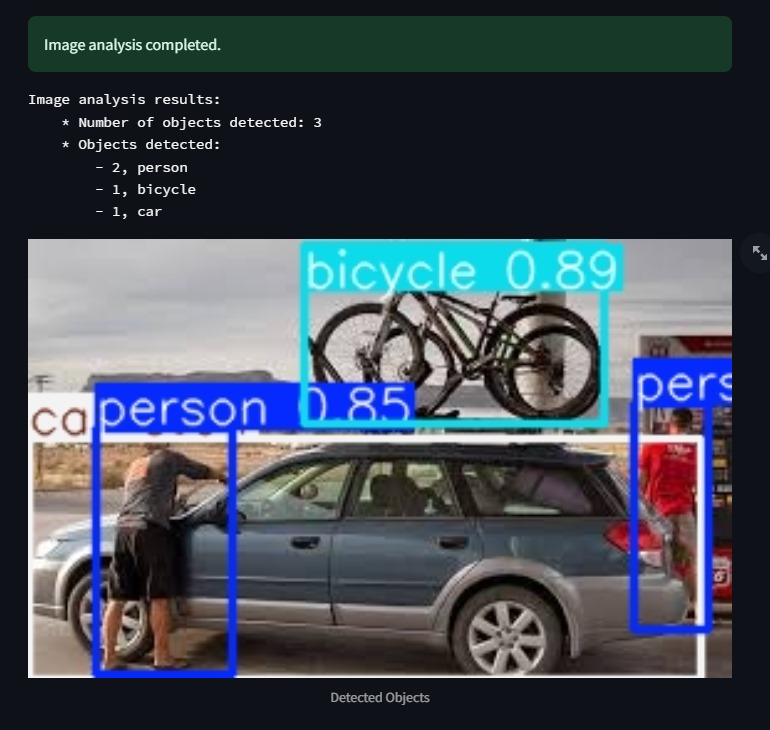
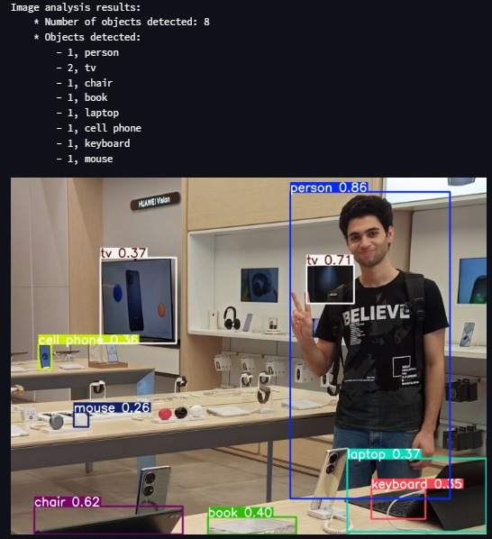

# Object Detection with YOLOv5

This is a Streamlit application for object detection using YOLOv5 models. Users can upload an image, select a YOLOv5 model, and get the detection results displayed.

## Features

- Upload an image (JPG, JPEG, PNG)
- Select from different YOLOv5 models (`yolov5s`, `yolov5m`, `yolov5l`, `yolov5n`, `yolov5x`)
- Display the uploaded image
- Perform object detection on the uploaded image
- Show the number of detected objects and their classes sorted by frequency
- Display the result image with detected objects and bounding boxes

## Installation

1. Clone the repository:

    ```bash
    git clone https://github.com/moatasem75291/slash-AI.git
    cd slash-AI
    ```

2. Create and activate a virtual environment (optional but recommended):

    ```bash
    python -m venv yolov5-env
    source yolov5-env/bin/activate  # On Windows use `yolov5-env\Scripts\activate`
    ```

3. Install the required dependencies:

    ```bash
    pip install -r requirements.txt
    ```

4. Install additional dependencies if not included in `requirements.txt`:

    ```bash
    pip install streamlit pillow matplotlib torch torchvision
    ```

## Usage

1. Run the Streamlit app:

    ```bash
    streamlit run main.py
    ```

2. Open your web browser and navigate to the URL provided by Streamlit (usually `http://localhost:8501`).

3. Use the sidebar to select a YOLOv5 model.

4. Upload an image using the file uploader.

5. View the uploaded image, detection results, and the image with detected objects.

## File Structure

- `main.py`: The main Streamlit application script.
- `image_analysor.py`: Contains the `ImageAnalysor` class for handling image analysis.
- `requirements.txt`: List of dependencies required for the application.
- `README.md`: This file, providing an overview of the project.

## Class: `ImageAnalysor`

This class handles image analysis using YOLOv5 models.

### Methods

- `__init__(self, model_name: str = "yolov5s") -> None`: Initializes the class with the specified YOLOv5 model.
- `_set_model(self, model_name)`: Loads the specified YOLOv5 model.
- `analyse_image(self, image_path: str) -> None`: Analyzes the provided image using the loaded model.
- `get_result(self) -> str`: Returns the detection results as a formatted string.
- `_prepare_output(self) -> Dict`: Prepares the output by counting the occurrences of each detected object class.

### Sample 

<pr>


## Contributing

Contributions are welcome! Please fork the repository and submit a pull request with your changes.

